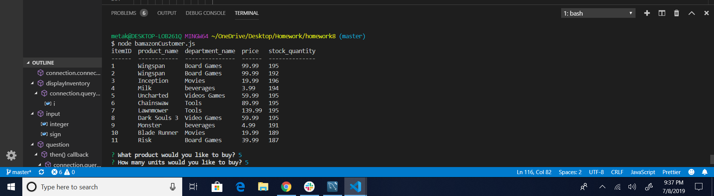
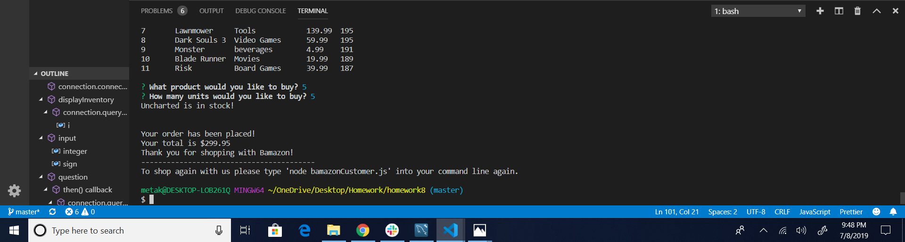
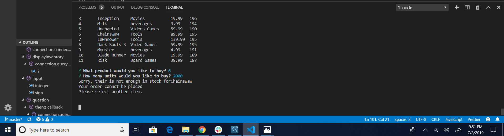

# homework8
bamazon homework

This assignment is similar to making a list of products from amazon!!

# Overview

In this assignment you are creating an amazon like storefront for customers ordering the products they would like to buy. This assignment applies what I have learned from mysql.

# Features

The assignment comes with inqiurer, mysql, and console.table. Console.table makes my list very organized.

# How to use

To start the program, type 'node bamazonCustomer' in to the terminal then hit return/enter on the keyboard. 

Once the program starts, it will show the table of the products listed from mysql.

You will be given two questions. The first is "What product would you like to buy?". This gives you the itemID of the products listed from 1 to 10. You must select one of the numbers by hitting enter, you select different numbers by hitting the up and down arrow keys.

The second question will ask you "How many units would you like to buy?". Type any number within the stock_quantity. Once you type a number you will get a message that says "Your order has bee placed!" It will also give you the total cost of what you bought.

If you type a number higher than the stock_quantity, you will get the message "Your order cannot be placed. Please select another item". Wait for three seconds than you go back to question 1 and start over.

The program will stop once your order has been placed. Or you can stop it by hitting Crtl+C or Command+C if your using a Mac. 

# Examples

To see the demo of this assignment observe the images carefully.

The first image shows the table of products and the questions answered.

This image shows that you placed an order and gives you additional instructions to use it again.

The message you will get if you order over the stock_quantity, it will restart after three seconds.

